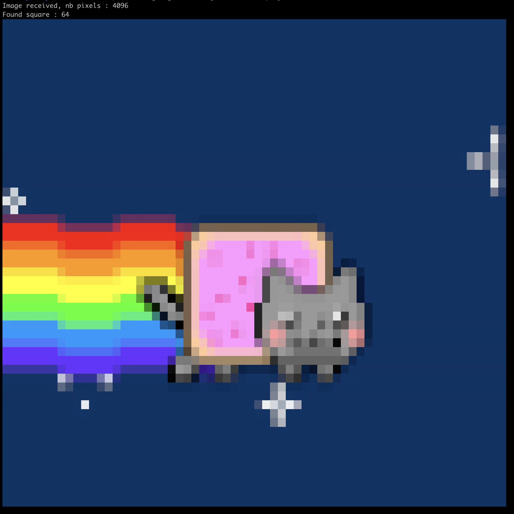

# YASL (Yet Another Stack Language)

YASL is a unique and challenging coding language that works with multiple inverted stacks. In this rush, we explored the intricacies of YASL, solved some interesting problems and improved our adaptability and coding skills. Unlike traditional languages such as C or C++, YASL requires a different approach to data storage and manipulation.

*If you have ever used a calculator like the HP 48GX, you will find yourself in a familiar environment with YASL.*

This project was realized in 48 hours by :

- [Alexandre Tchougourian](https://profile.intra.42.fr/users/atchougo#) (_atchougo_)
- [Tom Damerose](https://github.com/tdameros) (_tdameros_)


## Starters

### Exercise 0: yasl_hw
Display the classic welcome message. The example from the manual is a good starting point.

### Exercise 1: yasl_aff_param
Display the command line parameters, one per line, in the order they appear on the command line.

### Exercise 2: yasl_do
Perform a calculation or comparison between two values. The operator can be one of the following: + - * / % < > <= >= == !=
```
./yasl_macos yasl_do <value1> <operator> <value2>
```

### Exercise 3: yasl_repeat
Display each parameter N times, followed by a new line. The value of N starts with <start_num> and increases by one for each subsequent parameter. Print an error message if incorrect parameters are provided. <start_num> must be strictly positive.
```
./yasl_macos yasl_repeat <start_num> <value1> [ <value2> [ ...]]
```

### Exercise 4: yasl_fact
Compute the factorial of the given number. Implement recursion and handle potential errors with the parameter.
```
./yasl_macos yasl_fact <num>
```

### Exercise 5: yasl_split
Split the provided string using the specified separator (a single character) and display each part on a separate line. Handle incorrect separators properly. If you can find two different approaches to solve this exercise, you are on your way to mastering YASL.
```
./yasl_macos yasl_split <separator> <string>
```

### Exercise 6: yasl_interactive
Create a script that reads instructions from the standard input and executes them as YASL instructions. This mimics the interactive feature of the YASL interpreter.

## Main Course

In this exercise, we were to create a YASL script called display_b64. The script reads a string from the standard input, which represents a 24-bit RGB square image coded in base 64. Then display the image on the terminal using the 256 standard colors available in most implementations.

```
cat img2.rgb.b64 | ./yasl_macos display_b64
```

